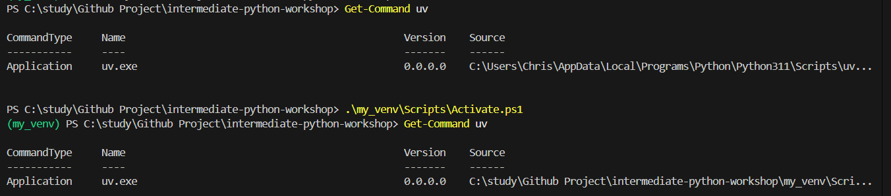

# 🐍 Running a Python Virtual Environment via PowerShell

This guide explains how to create, activate, use, and deactivate a Python virtual environment (`venv`) using PowerShell on Windows.

---

## 🔒 Why Use a Virtual Environment?

Using a virtual environment (`venv`) allows you to isolate project-specific dependencies from your global Python installation. This is especially important when working on multiple projects that require different versions of the same package. Without `venv`, installing or upgrading global packages can break other projects unexpectedly. By using a virtual environment, you ensure that each project has its own consistent and conflict-free environment.

---

## 📦 Requirements

- Python 3.x installed and added to your system `PATH`
- PowerShell (built into Windows)
- *(Optional)* Admin access if you need to change execution policy

---

## ✅ Step 1: Create a Virtual Environment

In your project directory, run:

```powershell
python -m venv my_venv
```

This creates a folder called my_venv/ containing the virtual environment.

## 🔓 Step 2: Enable Script Execution (If Needed)

PowerShell may block the activation script by default.  
If you see an error like:

```text
File ...\Activate.ps1 cannot be loaded because running scripts is disabled on this system.
```

Run the following command in the same PowerShell window to temporarily allow script execution:

```powershell
Set-ExecutionPolicy -Scope Process -ExecutionPolicy Bypass
```

ℹ️ This change is temporary and only applies to the current session. No permanent system settings are modified.

## 🚀 Step 3: Activate the Virtual Environment

Activate the virtual environment using:

```powershell
.\my_venv\Scripts\Activate.ps1
```

You should see the command prompt change to show the active environment, like this:

```text
(my_venv) PS C:\your\project\path>
```

## 📂 Step 4: Install Packages

Once activated, you can install Python packages using pip:

```powershell
pip install <package-name>
```

Example:

```powershell
pip install uv
```

These packages will be installed inside the virtual environment, isolated from global Python.



## ❎ Step 5: Deactivate the Environment

To exit the virtual environment, simply run:

```powershell
deactivate
```

Your command prompt will return to normal, and you'll be back in the system Python environment.
